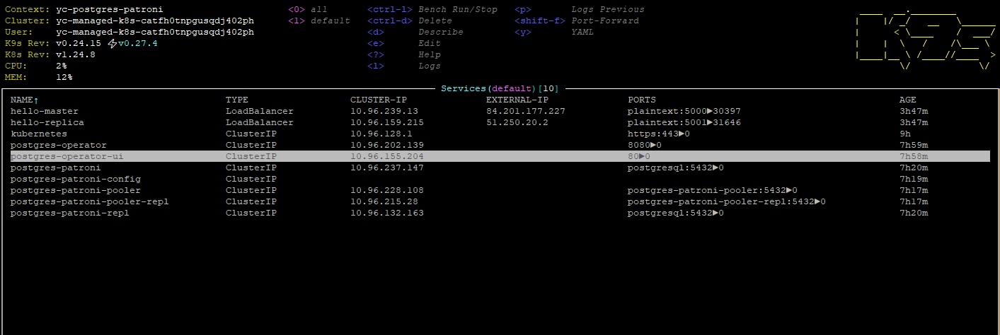
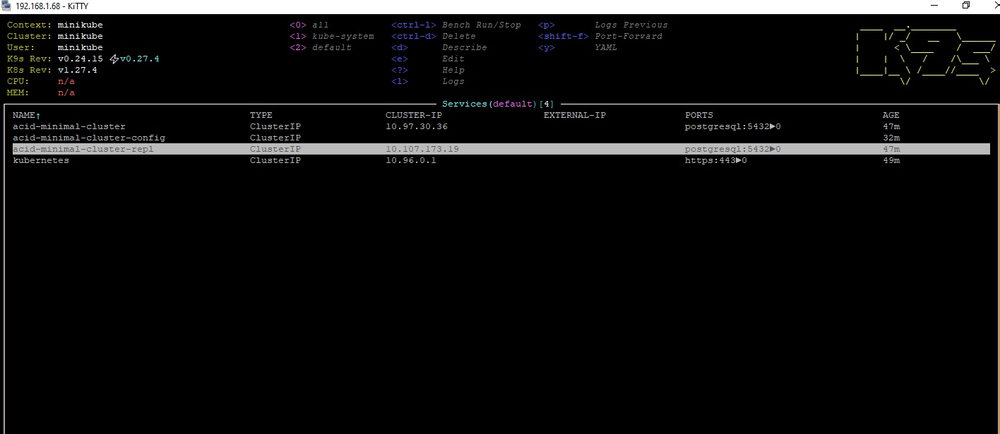

# postgres_praxis
<details>
<summary> <b>HW9. Deploy кластера Patroni в Kubernetes</b></summary>
Поднимаем инфраструктуру в YC c помощью terraform состоящую из кластера Kubernetes  (2 ноды по 2 CPU,8Gb,50Gb).

```
cd HW9/terraform
terraform apply
```
Подключаемся к кластеру Kubernetes

```
yc managed-kubernetes cluster get-credentials --id <ID - кластера в YC> --external
```
клонируем репозиторий
```
git clone https://github.com/zalando/postgres-operator
```
и устанавливаем postgres-operator в наш кластер
```
cd ./postgres-operator
helm install postgres-operator ./charts/postgres-operator
```
Устанавливаем UI
```
helm install postgres-operator-ui ./charts/postgres-operator-ui
```
для работы с кластером Kubernetes я использую утилиту K9S  
Делаем port-forward с сервиса postgres-operator-ui на localhost:8081. Заходим браузером на http://localhost:8081 и создвем кластер Patroni, состоящий из мастера и реплики и pooler-ов. 
Попробовал также запустить встроеный в оператор LoadBalanser, он запустился, но внешний адрес получить не может от YC, надо разбираться. Как временный костыль создал два ресурса типа service (LoadBalancer) с описанием HW9/k8s/loadbalancer-master.yml и HW9/k8s/loadbalanser-replica.yml. Первый из них будет ловить трафик на полученном внешнем IP на порту 5000 и пересылать на pooler мастера, второй - на порту 5001 - pooler реплики.  
В итоге получили следующую структуру нашего Patroni, развернутого в Kubernetes YC  

Пароль пользователя postgres находится в ресурсе secret кубера. Можно посмотреть его в утилите k9s, а можно воспользоваться командой
```
 export PGPASSWORD=$(kubectl get secret postgres.postgres-patroni.credentials.postgresql.acid.zalan.do -o 'jsonpath={.data.password}' | base64 -d)
 export PGSSLMODE=require
``` 
И далее пробуем подключиться на выданные LoadBalanser внешние IP на порт 5000 
```
psql -U postgres -h 84.201.177.227 -p 5000
psql (12.16 (Ubuntu 12.16-0ubuntu0.20.04.1), server 15.2 (Ubuntu 15.2-1.pgdg22.04+1))
WARNING: psql major version 12, server major version 15.
         Some psql features might not work.
SSL connection (protocol: TLSv1.3, cipher: TLS_AES_256_GCM_SHA384, bits: 256, compression: off)
Type "help" for help.

postgres=# \dt
            List of relations
 Schema |     Name     | Type  |  Owner
--------+--------------+-------+----------
 public | postgres_log | table | postgres
(1 row)

postgres=# create table int1 (i int);
CREATE TABLE
```
на порт 5001
```
 psql -U postgres -h 51.250.20.2 -p 5001
psql (12.16 (Ubuntu 12.16-0ubuntu0.20.04.1), server 15.2 (Ubuntu 15.2-1.pgdg22.04+1))
WARNING: psql major version 12, server major version 15.
         Some psql features might not work.
SSL connection (protocol: TLSv1.3, cipher: TLS_AES_256_GCM_SHA384, bits: 256, compression: off)
Type "help" for help.

postgres=# \dt
            List of relations
 Schema |     Name     | Type  |  Owner
--------+--------------+-------+----------
 public | int1         | table | postgres
 public | postgres_log | table | postgres
(2 rows)

postgres=# create table int2 (i int);
ERROR:  cannot execute CREATE TABLE in a read-only transaction
```
Кластер работает.
</details>
<details>
<summary> <b>HW8. Работа с большим объемом реальных данных</b></summary>
Поднимаем инфраструктуру в YC c помощью terraform состоящую двух узлов. ВМ(2 CPU,4Gb,150Gb(disk)).  
Одна из которых будут использоваться для поднятия кластера Postgresql], другая - для ClickHouse.

```
cd HW8/terraform;
terraform apply;
```
Файл HW8/ansible/inventory заполняется автоматически данными из terraform.  
Устанавливаем Postgresql
```
cd ../ansible;
ansible-playbook postgres_install.yml;
```
Устанавливаем ClickHouse. Для этой цели используем роль 
```
 git clone https://github.com/idealista/clickhouse_role.git
```
И далее

```
ansible-playbook ch_install.yml
```
Для примера загрузки будем использовать dataset "UK Property Price official data 1995-202304" c https://www.kaggle.com/  
Создаем таблицу в Postgresql
```
CREATE UNLOGGED TABLE public.uk_price (
    transaction_unique_identifier character(50),
    price character varying(50),
    date_of_transfer timestamp without time zone,
    postcode character varying(10),
    property_type character varying(10),
    "Old/New" character varying(10),
    duration character varying(10),
    paon character varying(100),
    saon character varying(50),
    street character varying(100),
    locality character varying(50),
    "Town/City" character varying(50),
    district character varying(50),
    county character varying(50),
    ppdcategory_type character varying(10),
    record_status character varying(10)
);
```
Загружаем данные в Postgresql
```
psql -d hw1 -c "\COPY uk_price from '/var/lib/postgresql/202304.csv' with CSV DELIMITER ','"
```
Делаем select count(*)
```
hw1=# select count(*) from  uk_price where property_type='S';
  count
---------
 7736105
(1 row)

Time: 210086.084 ms (03:30.086)
```
Время исполнения запроса 210086.084 ms  
Проделываем тоже самое  с ClickHouse. Подключаемся ssh к хосту.
```
clickhouse-client;

```
Создаем таблицу. 
```
CREATE TABLE uk_price (
    transaction_unique_identifier character(50),
    price character varying(50),
    date_of_transfer character varying(15),
    postcode character varying(10),
    property_type character varying(10),
    "Old/New" character varying(10),
    duration character varying(10),
    paon character varying(100),
    saon character varying(50),
    street character varying(100),
    locality character varying(50),
    "Town/City" character varying(50),
    district character varying(50),
    county character varying(50),
    ppdcategory_type character varying(10),
    record_status character varying(10)
)
ENGINE = MergeTree
ORDER BY tuple(date_of_transfer);
```
Загружаем данные. Вводим команду.
```
clickhouse-client -q "INSERT INTO default.uk_price FORMAT CSV" < 202304.csv
```
И делаем select
```
epdcdaaim05plkvu2paj.auto.internal :) select count(*) from  default.uk_price where property_type='S'

SELECT count(*)
FROM default.uk_price
WHERE property_type = 'S'

Query id: 5a4677fe-fa9a-4ffe-9721-fbc5c3d06264

┌─count()─┐
│ 7736105 │
└─────────┘

1 row in set. Elapsed: 0.889 sec. Processed 28.28 million rows, 282.76 MB (31.79 million rows/s., 317.94 MB/s.)
```
Видим время исполнения запроса 889ms. 
  
Вывод в Postgresql более чем на два порядка дольше выполняется данный запрос.

</details>
<details>
<summary> <b>HW7. Разворачиваем кластер Postgresql в minikube</b></summary>

Скачиваем репозиторий
```
git clone https://github.com/zalando/postgres-operator.git
cd postgres-operator
```
Поднимаем одной командой состоящий из одного инстанса кластер Postgresql в minikube 

```
./run_operator_locally.sh
```
В итоге получам


</details>
<details>
<summary> <b>HW6. Деплой кластера Patroni в Yandex Cloud с использованием Ansible</b></summary>
Поднимаем инфраструктуру в YC c помощью terraform состоящую четырех узлов. ВМ(2 CPU,4Gb,10Gb(disk)).
Три из которых будут использоваться для поднятия кластера Patroni, etcd-кластера и HAProxy. Одна ВМ используется для разворачивания на ней Ansible. Также поднимается Load Balancer с целевой группой хостов, которыми являются ноды с HAProxy, в нашем случае это ноды Patroni-кластера. Инфраструктура подобна приведенной здесь https://github.com/vitabaks/postgresql_cluster/blob/master/images/TypeA.png, только VIP заменяем IP Load Balancer

```
cd HW6/terraform;
terraform apply;
```
И так имеем
```
terraform show;
```
Видим наши хосты
```
...
Outputs:

external_ip_address_vm_0 = "158.160.16.113"
external_ip_address_vm_1 = "158.160.25.200"
external_ip_address_vm_2 = "84.201.176.85"
external_ip_address_vm_3 = "158.160.25.155"
internal_ip_address_vm_0 = "10.129.0.16"
internal_ip_address_vm_1 = "10.129.0.13"
internal_ip_address_vm_2 = "10.129.0.30"
internal_ip_address_vm_3 = "10.129.0.19"

```

Файл HW6/ansible/inventory заполняется автоматически данными из terraform.  
Далее настраиваем хост с Ansible, который находится в той же подсети, что и будущие ноды кластера.  
Настройки кластера патрони находятся здесь HW6/ansible/postgresql_cluster. HW6/ansible/postgresql_cluster/inventory - инвентори-файл, заполненный автоматически данными Terraform. HW6/ansible/postgresql_cluster/vars/main.yml - параметры настройки кластера. Patroni-кластер будем разворачивать изпользуя плейбук репозитория https://github.com/vitabaks/postgresql_cluster.git. Данный репорий будет склонирован на хосте с Ansible, а вот инвентори-файл и файл параметров будут скопированы из папки HW6/ansible/patroni_cluster
```
cd ../ansible;
ansible-playbook set_remote_ansible_host.yml;
```
Коннектимся ssh на хост с Ansible и там уже запускаем следующие команды.

```
cd postgresql_cluster/;
ansible-playbook deploy_pgcluster.yml;
```
Заходим на один из хостов кластера Patroni и вводим команду
```
ubuntu@pgnode01:~$ sudo patronictl -c /etc/patroni/patroni.yml list
```

```
2023-10-16 07:25:43,840 - WARNING - postgresql parameter max_prepared_transactions=0 failed validation, defaulting to 0
+ Cluster: postgres-cluster-type-a +-----------+----+-----------+
| Member   | Host        | Role    | State     | TL | Lag in MB |
+----------+-------------+---------+-----------+----+-----------+
| pgnode01 | 10.129.0.13 | Leader  | running   |  3 |           |
| pgnode02 | 10.129.0.30 | Replica | streaming |  3 |         0 |
| pgnode03 | 10.129.0.19 | Replica | streaming |  3 |         0 |
+----------+-------------+---------+-----------+----+-----------+

```
Вывод - кластер поднялся.  
Если посмотреть в консоли YC Load Balancer, то мы увидим следующую картину


</details>
<details>
<summary> <b>HW5. Бэкапы PostgreSQL, использование утилиты WAL-G</b></summary>
Поднимаем инфраструктуру в YC c помощью terraform в одной ВМ(2 CPU,4Gb,30Gb(disk)). Ставим PostgreSQL на ВМ с использованием Ansible.

```
cd HW5/terraform;
terraform apply;
```
Файл HW4/ansible/inventory заполняется автоматически данными из terraform.  
Ставим PostgreSQL 15 на ВМ с использованием Ansible.  

```
cd ../ansible;
ansible-playbook postgres_install.yml;
```
Для создания бэкапа с помощью WAL-G
Устанавливаем WAL-G

```
ansible-playbook install_walg.yml;
```
заходим на ВМ по ssh. Все остальные действия выполняем из-под пользователя postgres

Создаем таблицу в БД hw1 и заполняем ее данными
```
sudo su postgres
psql hw1 -c "create table test(i int);"
psql hw1 -c "insert into test values (10), (20), (30);"
```
Делаем backup
```
wal-g backup-push /var/lib/postgresql/15/main
```
меняем строку в таблице test
```
psql hw1 -c "UPDATE test SET i = 3 WHERE i = 30"
```
Далее
```
psql -p 5432 hw1 -c "select * from test;"
```
вывод
```
 i
----
 10
 20
  3
(3 rows)
```
делаем еще раз бэкап
```
wal-g backup-push /var/lib/postgresql/15/main
```
создаем кластер main2
```
pg_createcluster 15 main2
```
вывод
```
Creating new PostgreSQL cluster 15/main2 ...
/usr/lib/postgresql/15/bin/initdb -D /var/lib/postgresql/15/main2 --auth-local peer --auth-host scram-sha-256 --no-instructions
The files belonging to this database system will be owned by user "postgres".
This user must also own the server process.

The database cluster will be initialized with locale "en_US.UTF-8".
The default database encoding has accordingly been set to "UTF8".
The default text search configuration will be set to "english".

Data page checksums are disabled.

fixing permissions on existing directory /var/lib/postgresql/15/main2 ... ok
creating subdirectories ... ok
selecting dynamic shared memory implementation ... posix
selecting default max_connections ... 100
selecting default shared_buffers ... 128MB
selecting default time zone ... Etc/UTC
creating configuration files ... ok
running bootstrap script ... ok
performing post-bootstrap initialization ... ok
syncing data to disk ... ok
Warning: systemd does not know about the new cluster yet. Operations like "service postgresql start" will not handle it. To fix, run:
  sudo systemctl daemon-reload
Ver Cluster Port Status Owner    Data directory               Log file
15  main2   5433 down   postgres /var/lib/postgresql/15/main2 /var/log/postgresql/postgresql-15-main2.log
```
очищаем директория с  БД кластера main2
```
rm -rf /var/lib/postgresql/15/main2
```
разворачиваем в директорию backup полученный с кластера main
```
wal-g backup-fetch /var/lib/postgresql/15/main2 LATEST
```
вывод
```
INFO: 2023/10/04 09:31:50.723386 Selecting the latest backup...
INFO: 2023/10/04 09:31:50.724298 LATEST backup is: 'base_000000010000000000000010_D_00000001000000000000000E'
INFO: 2023/10/04 09:31:50.733043 Delta from base_00000001000000000000000E at LSN 0/E000028
INFO: 2023/10/04 09:31:50.740465 Finished extraction of part_003.tar.br
INFO: 2023/10/04 09:32:06.002500 Finished extraction of part_001.tar.br
INFO: 2023/10/04 09:32:06.003451 Finished extraction of pg_control.tar.br
INFO: 2023/10/04 09:32:06.003486
Backup extraction complete.
INFO: 2023/10/04 09:32:06.003518 base_00000001000000000000000E fetched. Upgrading from LSN 0/E000028 to LSN 0/10000028
INFO: 2023/10/04 09:32:06.019171 Finished extraction of part_001.tar.br
INFO: 2023/10/04 09:32:06.024261 Finished extraction of part_003.tar.br
INFO: 2023/10/04 09:32:06.037785 Finished extraction of pg_control.tar.br
INFO: 2023/10/04 09:32:06.037893
Backup extraction complete.
```
создаем флаг восстановления
```
touch "/var/lib/postgresql/15/main2/recovery.signal"
```
и стартуем кластер main2
```
pg_ctlcluster 15 main2 start
```
вывод
```
Warning: the cluster will not be running as a systemd service. Consider using systemctl:
  sudo systemctl start postgresql@15-main2
```
select таблицы test
```
psql -p 5433 hw1 -c "select * from test;"
```
```
 i
----
 10
 20
  3
(3 rows)
```
Вывод - восстановление из бэкапа успешно проведено

</details>

<details>
<summary> <b>HW4. Оптимизация PostgreSQL</b></summary>
Поднимаем инфраструктуру в YC c помощью terraform в одной ВМ(2 CPU,4Gb). Ставим PostgreSQL на ВМ с использованием Ansible.

```
cd HW4/terraform;
terraform apply;
```
Файл HW4/ansible/inventory заполняется автоматически данными из terraform.  
Ставим PostgreSQL 15 на ВМ с использованием Ansible.  

```
cd ../ansible;
ansible-playbook postgres_install.yml;
ansible-playbook mv_db_postgresql_vm1.yml;
ansible-playbook install_utils.yml;
```
Запускаем инициализацию  
```
pgbench -i -s 50 hw1
```
меняем параметры:  
shared_buffers = 2048MB  
synchronous_commit = off  

проводим тестовый прогон
```
pgbench -c 10 -P 5 -T 60 hw1
```
итог
```
postgres@epdq1i07fnov6p5ekq8f:~$ pgbench -c 10 -P 5 -T 60 hw1
pgbench (15.4 (Ubuntu 15.4-2.pgdg22.04+1))
starting vacuum...end.
progress: 5.0 s, 1806.8 tps, lat 5.490 ms stddev 1.222, 0 failed
progress: 10.0 s, 1898.8 tps, lat 5.265 ms stddev 1.326, 0 failed
progress: 15.0 s, 1949.6 tps, lat 5.128 ms stddev 0.998, 0 failed
progress: 20.0 s, 1896.0 tps, lat 5.272 ms stddev 1.046, 0 failed
progress: 25.0 s, 1900.6 tps, lat 5.260 ms stddev 1.030, 0 failed
progress: 30.0 s, 1906.8 tps, lat 5.242 ms stddev 1.008, 0 failed
progress: 35.0 s, 1907.2 tps, lat 5.241 ms stddev 0.976, 0 failed
progress: 40.0 s, 1926.6 tps, lat 5.191 ms stddev 1.010, 0 failed
progress: 45.0 s, 1964.8 tps, lat 5.088 ms stddev 0.934, 0 failed
progress: 50.0 s, 1925.0 tps, lat 5.193 ms stddev 1.012, 0 failed
progress: 55.0 s, 1892.4 tps, lat 5.283 ms stddev 1.257, 0 failed
progress: 60.0 s, 1872.6 tps, lat 5.338 ms stddev 1.457, 0 failed
transaction type: <builtin: TPC-B (sort of)>
scaling factor: 50
query mode: simple
number of clients: 10
number of threads: 1
maximum number of tries: 1
duration: 60 s
number of transactions actually processed: 114246
number of failed transactions: 0 (0.000%)
latency average = 5.248 ms
latency stddev = 1.125 ms
initial connection time = 36.671 ms
tps = 1904.349851 (without initial connection time)
```

Настройки PostgreSQL оптимальны под данный стандартный тест.
</details>
<details>
<summary> <b>HW3. Деплой Postgresql сервера в Docker</b></summary>
Поднимаем инфраструктуру в YC c помощью terraform, состоящую из одного узла (2 CPU,4Gb,10Gb).  

```
cd HW3/terraform;
terraform apply;
```
Файл HW3/ansible/inventory заполняется автоматически данными из terraform.  
Устанавливаем, используя Ansible role, docker на ВМ, запускаем контейнер с Postgresql, cоздаем директорию /home/ubuntu/postgresql_data, которую будем использовать как volume контейнера, прокидываем порт 5432 на хост. Пароль от пользователя БД postgres хранится в файле HW3/ansible/vars.yml
```
cd ../ansible
ansible-galaxy collection install community.docker
ansible-galaxy role install geerlingguy.docker
ansible-playbook docker_install_run_postgres.yml -v
```
Если потом удалить контейнер Postgres с ВМ, а потом заного запустить 
```
ansible-playbook docker_install_run_postgres.yml -v
```
То данные сохранятся

</details>

<details>
<summary> <b>HW2</b></summary>
Поднимаем инфраструктуру в YC c помощью terraform в составе двух ВМ. Ставим PostgreSQL на ВМ с использованием Ansible.
Файл HW2/ansible/inventory заполняется автоматически данными из terraform. PostgreSQL - устанавливается на обе виртуальные машины pg-1 и pg-2

```
cd HW2/terraform;  
./infra_up.sh
```  

переносим БД PostgreSQL на виртуальной машине pg-1 на дополнительный диск

```
cd HW2/ansible;
ansible-playbook mv_db_postgresql_pg1.yml
```
останавливаем PostgreSQL и размонтируем disk-2 с нашей БД
```
ansible-playbook stop_db_postgresql_pg1.yml
```
далее надо изменить файл HW2/terraform/main.tf.  
Hаходим блок кода, комментируем его у инстанса pg-1 и добавляем данный диск в инстанс pg-2  
```
secondary_disk {
  disk_id = yandex_compute_disk.disk-2.id
  device_name = "pgdata"
}
```
Далее применяем инфраструктуру
```
cd HW2/terraform;  
terraform apply
```  
монтируем disk-2 и запускаем PostgreSQL с БД на disk-2 на ВМ pg-2 
```
cd HW2/ansible;
ansible-playbook start_db_postgresql_to_pg2.yml
```
</details>
<details>
<summary> <b>HW1</b></summary>
Поднимаем инфраструктуру в YC c помощью terraform в составе одной ВМ. Ставим PostgreSQL на ВМ с использованием Ansible.  
```
cd HW1/terraform;  
./infra_up.sh
```  
подключаемся к ВМ 
```
ssh -i ~/.ssh/appuser ubuntu@<IP address- ВМ>
```
заходим в нашу созданную БД hw1
```
psql -U postgres -d hw1
```
смотрим текущий уровень изоляции
```
show transaction isolation level
```

    transaction_isolation
    -----------------------
    read committed
    (1 row)

создаем таблицу
```
create table persons(id serial, first_name text, second_name text);
insert into persons(first_name, second_name) values('ivan', 'ivanov');
insert into persons(first_name, second_name) values('petr', 'petrov');
commit;
```

подключаемся к PostgreSQL второй сессией
текущий уровень изоляции по умолчанию
```
show transaction isolation level
```
    transaction_isolation
    -----------------------
    read committed

отключаем autocommit во второй сессии
```
\set AUTOCOMMIT off
```
В первой сессии также отключаем autocommit
```
\set AUTOCOMMIT off
```
добавляем еще одну строку в первой сессии
```
insert into persons(first_name, second_name) values('sergey', 'sergeev');
```
если попробовать прочитать таблицу persons во второй сессии
```
select * from persons;
```
мы не увидим новой записи, т.к. Postgres не допускает грязного чтения незакомиченных изменений.
делаем в первой сессии
```
commit;
```
тогда во второй открытой сессии мы увидим новую запись. уровень изоляции read committed позволяет сделать это
Завершаем транзакцию во второй сессии
```commit;
```

Меняем уровень изоляции в первой и второй сессии
```
set transaction isolation level repeatable read;
```
делаем вставку строки в первой сессии
```
insert into persons(first_name, second_name) values('sveta', 'svetova');
```
и закрываем транзакцию в первой сессии
```
commit;
```
при измененном уровне изоляции *repeatable read
мы не увидим новой строки во второй сессии, пока не закроем транзакцию во второй сессии.

hw1=*# select * from persons;  
 id | first_name | second_name  
----+------------+-------------  
  1 | ivan       | ivanov  
  2 | petr       | petrov  
  8 | sergey     | sergeev  
(3 rows)  

hw1=*# commit;  
COMMIT  
hw1=# select * from persons;  
 id | first_name | second_name  
----+------------+-------------  
  1 | ivan       | ivanov  
  2 | petr       | petrov  
  8 | sergey     | sergeev  
 10 | sveta      | svetova  
(4 rows)  
</details>


